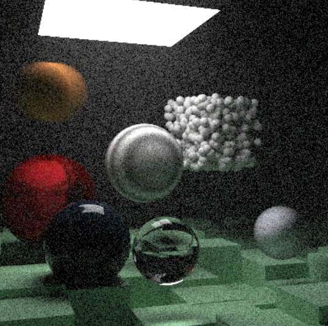

# Stochastic Monte Carlo Ray Tracer

A physically based Monte Carlo path tracer written in **C++**, implementing global illumination, volumetric media, acceleration structures, and polygonal geometry from scratch.



---

## Project Overview

This project is a custom **stochastic path tracing renderer** designed to simulate realistic light transport using Monte Carlo integration. The renderer supports indirect lighting, participating media, emissive geometry, and complex scene construction.  

While inspired by the *Ray Tracing in One Weekend* book series, this implementation extends beyond the introductory material by integrating additional geometry types, a full BVH acceleration structure, and volumetric effects.

---

## Features

### Geometry & Scene Representation
- **Spheres** with analytic ray–sphere intersections
- **Triangle primitives** using the Möller–Trumbore intersection algorithm
- **Quadrilaterals (quads)** for walls, floors, and area lights
- **Instancing** via translation and rotation transforms
- **Manually constructed meshes** composed of triangle groups

### Lighting & Materials
- **Global Illumination** using recursive Monte Carlo path tracing
- **Diffuse (Lambertian) materials**
- **Metallic materials** with adjustable roughness
- **Dielectrics** (glass/water) using refraction and Schlick approximation
- **Emissive materials** for physically based area lights
- **Volumetric media** (fog/smoke) via constant-density participating media

### Textures
- **Image textures** with UV mapping (e.g., Earth texture)
- **Procedural Perlin noise** for marble and turbulence effects
- **Checkerboard procedural textures**

### Performance & Core Systems
- **Bounding Volume Hierarchy (BVH)** for accelerated ray–object intersection
- **Motion blur** via temporal ray sampling
- **High sample-count rendering** with importance-driven recursion limits

---

## Build & Run Instructions

### Visual Studio (Recommended)
1. Clone the repository.
2. Open `RayTracer.vcxproj` in Visual Studio.
3. Set configuration to **Release**.
4. Build and run (`Ctrl + F5`).
5. Output is written to `image.ppm`.

### References

[_Ray Tracing in One Weekend_](https://raytracing.github.io/books/RayTracingInOneWeekend.html)

[_Ray Tracing: The Next Week_](https://raytracing.github.io/books/RayTracingTheNextWeek.html)

### Command Line (g++)
```bash
g++ main.cpp -O3 -o raytracer
./raytracer > image.ppm
